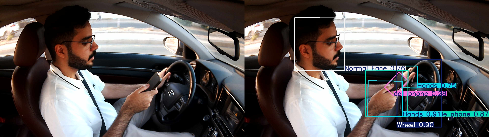
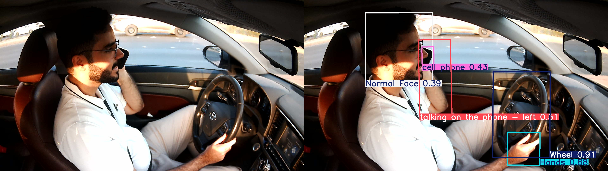
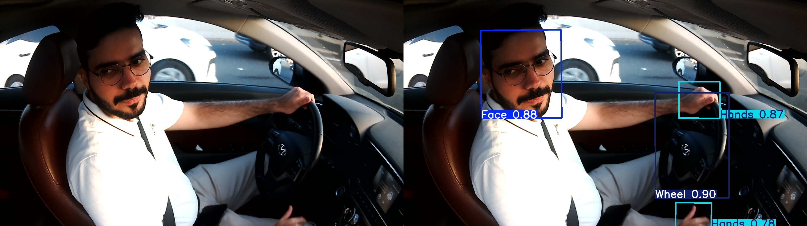
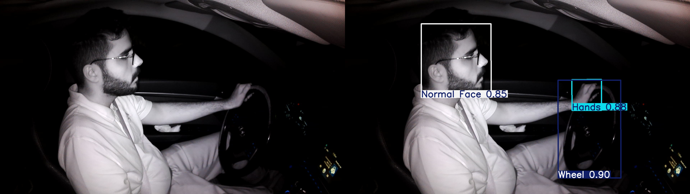
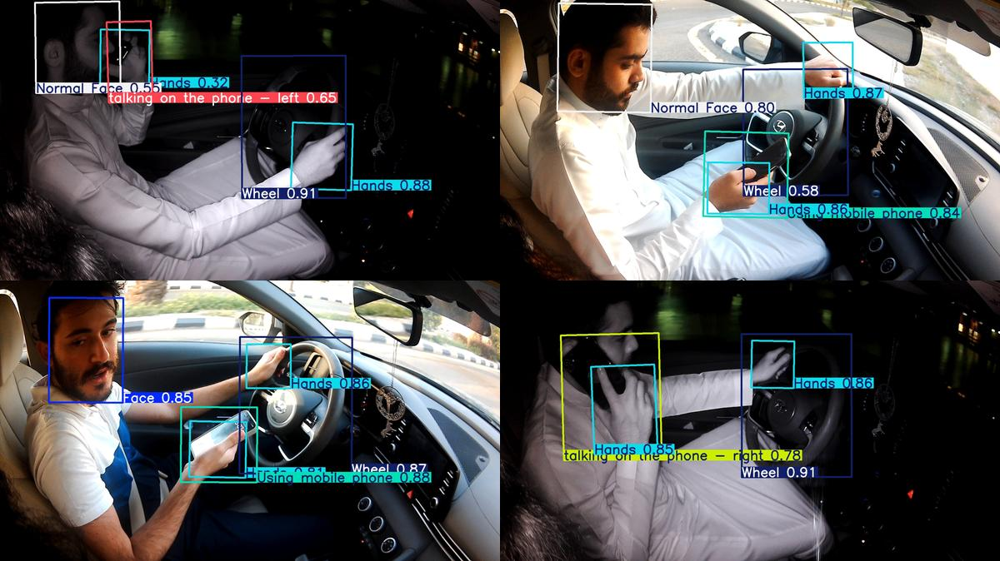

# 🚗 Driver Distraction Detection System

This project presents a real-time embedded system designed to detect driver distractions using advanced computer vision and deep learning techniques. Leveraging the NVIDIA Jetson Nano 4GB, the system continuously monitors the driver's behavior through an RGB-IR camera and identifies key distraction types such as mobile phone usage, talking to passengers, and improper hand placement on the steering wheel. The solution combines efficient object detection with GPIO-based feedback mechanisms, making it suitable for real-world deployment in vehicles.
## 👨‍💻 Team Members
- Zyad Alzahrani 
- Jawad Maimani 
- Abdullah Alghamdi 

## 📘 Project Overview
Driver distraction is a major cause of road accidents. Our system detects four critical types of distractions:

### 1. Using a Mobile Phone

### 2. Talking on the Phone (Left or Right Hand)

### 3. Talking to Passengers

### 4. Not Holding the Steering Wheel

## 🧪 Testing Environment
We tested our system in multiple lighting and setup environments.
Below is a representative comparison:

## 📑 Example Report
An example PDF report generated by the system:

👉 [Download Report Example](Report_Example.pdf)

## 🔧 Hardware Components
- Jetson Nano 4GB
- Arducam 1080p RGB-IR Camera
- Push Button (for generating PDF reports)
- Buzzer for alerts
- 12V car power adapter
- Custom 3D printed mounts and case

## 🧠 Software & Tools
- YOLOv8s-OBB from Ultralytics
- OpenCV (Image capture and display)
- Shapely (Geometric calculations for OBB)
- Jetson.GPIO for GPIO interaction
- Threading + Subprocess for multitasking
- Python 3.8
- JetPack SDK + PyTorch + CUDA/cuDNN

## 🗂️ Features
- Real-time image capture every 30 seconds
- YOLOv8s-OBB based object detection with rotated bounding boxes
- Custom distraction analysis logic
- 2-second buzzer alert when a distraction is detected
- Button trigger to generate `PDF_FILE.py` report in a separate thread
- Automatic logging of distraction types and counts
- Deletes captured image after use to save disk space

## 📸 Classes Detected
| Class ID | Class Name                     |
|----------|--------------------------------|
| 0        | Talking to Passenger           |
| 1        | Hands                          |
| 3        | Using Mobile Phone             |
| 4        | Steering Wheel                 |
| 6        | Talking on Phone (Left/Right)  |
| 7        | Normal Face                    |

## 🧪 Validation
- Achieved over **91% mAP@0.5**
- Successfully deployed on Jetson Nano for real-time performance
- Robust under both day and night conditions using RGB + IR camera

## ⚙️ Future Work
- Expand distraction classes (e.g., eating, drowsiness)
- Add dashboard for remote fleet management
- Integrate haptic or visual alerts
- Optimize for Jetson Orin Nano

---

## 📜 License
This project is part of the EE 499 Senior Design Course at King Abdulaziz University. Use is permitted for educational and non-commercial purposes only.
